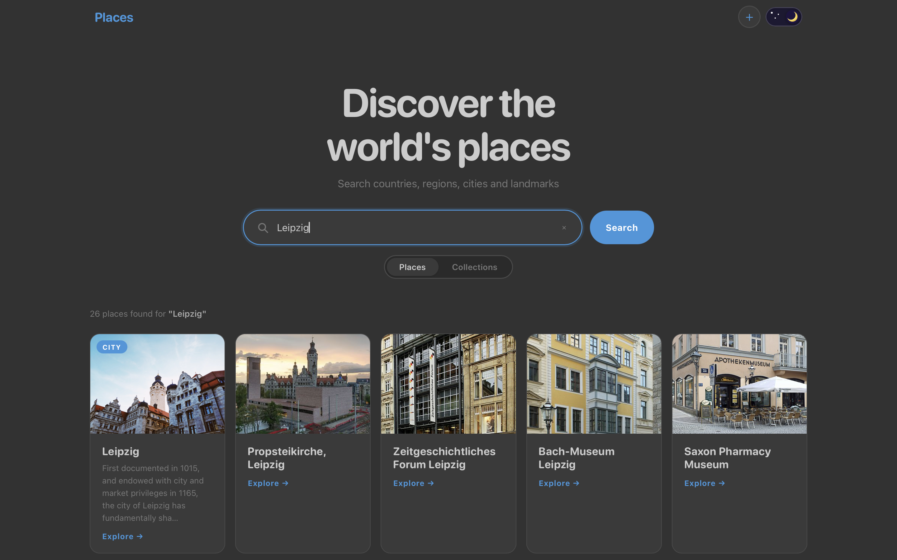

# Places Frontend

[](https://freelenzer.github.io/places-frontend/)

[](https://freelenzer.github.io/places-frontend/)

A Vue 3 + Vite admin interface for exploring POIs and collections.

## Local development

**1. Install dependencies**
```bash
npm install
```

**2. Configure environment**

Copy the example env file and fill in your values:
```bash
cp .env.example .env.local
```

`.env.local` is gitignored — never commit real secrets. Edit it:
```
VITE_API_HOST=http://localhost:8080   # or /api to use the Vite proxy
VITE_UNSPLASH_CLIENT_ID=your_key_here
VITE_MAPKIT_TOKEN=your_jwt_here
```

The Vite dev proxy rewrites `/api/*` → `http://127.0.0.1:8080/*`, so `VITE_API_HOST=/api` avoids CORS when running the backend locally.

**3. Start the dev server**
```bash
npm run dev   # http://localhost:5173
```

## Commands

```bash
npm run dev      # Start dev server
npm run build    # Production build → dist/
npm run preview  # Serve the dist/ build locally
```

## Deployment

Pushes to `main` that change files under `Web/bucketlist-cms/` automatically trigger the GitHub Actions workflow [deploy-cms.yml](../../.github/workflows/deploy-cms.yml). It SSHes into the server, pulls the latest code, and rebuilds the `cms` Docker container with the secrets injected as build args.

**3. Add these secrets** in the GitHub repo under Settings → Secrets and variables → Actions:

| Secret | Description |
|---|---|
| `VITE_API_HOST` | Backend URL (e.g. `http://your-server:8080`) |
| `VITE_UNSPLASH_CLIENT_ID` | Unsplash API key |
| `VITE_MAPKIT_TOKEN` | MapKit JS JWT |

### How secrets are injected

Vite bakes `VITE_*` environment variables into the bundle at build time. The workflow passes them as Docker build args → the Dockerfile sets them as `ENV` before running `npm run build`.

No secrets are stored on the server or in the image at runtime.
